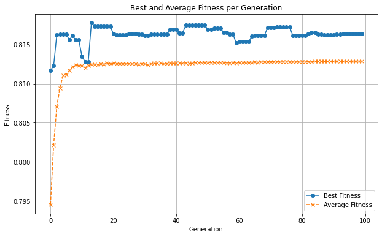

# U-Net Ensemble Segmentation with Genetic Algorithm Optimisation

Skin lesion segmentation on the **ISIC 2018** dataset using five U-Net-based
architectures combined through a **genetic algorithm-optimised weighted ensemble**.

The GA ensemble reaches **0.931 accuracy, 0.878 Dice, 0.804 Jaccard** on the ISIC 2018
test set — outperforming every individual model and a standard average ensemble, trained
entirely on a single consumer GPU.

> MSc thesis research, Cyprus International University (2024).
> Accepted for oral presentation at **ICAFS 2025** (17th International Conference on
> Theory and Application of Fuzzy Systems, Iași, Romania) — indexed by Scopus and
> Web of Science.

---

## Results

ISIC 2018 Task 1 test set (1,000 images), 256×256 input.

| Model | Accuracy | Dice | Jaccard | Sensitivity | Precision | Thresh. Jaccard |
|---|---|---|---|---|---|---|
| U-Net (baseline) | 0.896 | 0.811 | 0.716 | 0.868 | 0.829 | 0.611 |
| U-Net + MobileNetV3Large | 0.905 | 0.825 | 0.739 | 0.837 | **0.884** | 0.654 |
| U-Net + ConvNeXtBase | 0.895 | 0.815 | 0.724 | 0.858 | 0.844 | 0.622 |
| U-Net + ResNet50V2 | 0.927 | 0.870 | 0.786 | **0.914** | 0.859 | 0.717 |
| U-Net + VGG19 | 0.906 | 0.824 | 0.730 | 0.860 | 0.856 | 0.630 |
| Average ensemble | 0.918 | 0.852 | 0.770 | 0.879 | 0.880 | 0.697 |
| **GA-weighted ensemble** (τ = 0.6) | **0.931** | **0.878** | **0.804** | 0.891 | **0.901** | **0.743** |

*Thresholded Jaccard follows the ISIC 2018 challenge rule: per-image scores below 0.65
count as 0.*

For context, the top five of 200 teams on the ISIC 2018 live leaderboard scored 0.804
to 0.836 thresholded Jaccard. This approach reaches 0.743 with no external data, no
custom architecture, and no multi-scale training.

---

## Approach

**1 — Five segmentation models.** A from-scratch U-Net, plus four variants where the
encoder is replaced by an ImageNet-pretrained backbone (MobileNetV3Large, ConvNeXtBase,
ResNet50V2, VGG19). Encoders are frozen; decoders train from random initialisation with
skip connections into the matching encoder stages.

**2 — Soft prediction export.** Each trained model writes per-pixel probability maps
(not binarised masks) for the validation and test sets.

**3 — Genetic algorithm weight search.** A GA searches the five-dimensional blend weight
vector that maximises Jaccard on the **validation** set. Weights are fitted on validation
and reported on test, so the blend never sees the test data.

| Parameter | Value |
|---|---|
| Fitness | Mean Jaccard of the weighted soft-prediction blend |
| Selection | Elitism (top 5% carried forward unchanged) |
| Crossover | Single-point, rate 0.8 |
| Mutation | Gaussian, rate 0.05, annealed by `rate × (1 − gen / max_gen)` |
| Population | Randomly initialised weight vectors |

**4 — Threshold sweep.** The blended probability map is binarised at 0.4, 0.5 and 0.6;
0.6 gave the best precision/recall balance and is used for the headline result.

### Selection strategies compared

Three GA variants were implemented and compared by best validation Jaccard:

| Variant | Script | Best validation fitness |
|---|---|---|
| Single-point + Gaussian mutation | `ga_ensemble_simple.py` | 0.8164 |
| Tournament selection | `ga_ensemble_tournament.py` | 0.8128 |
| Microbial GA | `ga_ensemble_microbial.py` | 0.8031 |

Per-generation best/average fitness arrays and the final weight vectors for every run are
in [`Models/GA_ensembling/artifacts/`](Models/GA_ensembling/artifacts).



---

## Sample outputs

| Model | Training curves | Predictions |
|---|---|---|
| U-Net | [curves](Models/UNet/unet_training_curves.png) | [masks](Models/UNet/unet_predictions.png) |
| MobileNetV3Large | [curves](Models/MobileNetV3Large/mobilenetv3large_training_curves.png) | [masks](Models/MobileNetV3Large/mobilenetv3large_predictions.png) |
| ConvNeXtBase | [curves](Models/ConvNextBase/convnextbase_training_curves.png) | [masks](Models/ConvNextBase/convnextbase_predictions.png) |
| ResNet50V2 | [curves](Models/ResNet50V2/resnet50v2_training_curves.png) | [masks](Models/ResNet50V2/resnet50v2_predictions.png) |
| VGG19 | [curves](Models/VGG19/vgg19_training_curves.png) | [masks](Models/VGG19/vgg19_predictions.png) |

---

## Repository structure

```
Models/
├── UNet/                   # baseline U-Net
│   ├── model.py            # architecture
│   ├── metrics.py          # Dice, IoU, Dice loss
│   ├── train.py            # data pipeline + training loop
│   ├── eval.py             # test-set evaluation
│   ├── unet_training_curves.png
│   ├── unet_predictions.png
│   └── unet_test_metrics.txt
├── MobileNetV3Large/       # same layout, pretrained encoder
├── ConvNextBase/
├── ResNet50V2/
├── VGG19/
├── Average_ensembling/     # unweighted mean baseline
│   ├── average_ensemble.py
│   └── evaluate_average_ensemble.py
└── GA_ensembling/          # genetic algorithm weight optimisation
    ├── ga_ensemble_simple.py
    ├── ga_ensemble_tournament.py
    ├── ga_ensemble_microbial.py
    └── artifacts/          # best weights + per-generation fitness (.npy)
```

---

## Setup

```bash
git clone https://github.com/farshid92/UNet-Ensemble-Segmentation.git
cd UNet-Ensemble-Segmentation
python -m venv .venv && source .venv/bin/activate   # Windows: .venv\Scripts\activate
pip install -r requirements.txt
```

**Data.** Download ISIC 2018 Task 1 from the
[ISIC Challenge archive](https://challenge.isic-archive.com/data/#2018) and arrange it as:

```
ISIC_Challenge_Dataset/
├── ISIC2018_Task1-2_Training_Input/
├── ISIC2018_Task1_Training_GroundTruth/
├── ISIC2018_Task1-2_Validation_Input/
├── ISIC2018_Task1_Validation_GroundTruth/
├── ISIC2018_Task1-2_Test_Input/
└── ISIC2018_Task1_Test_GroundTruth/
```

**Configuration.** Paths are read from environment variables, with repo-relative defaults:

| Variable | Default | Used by |
|---|---|---|
| `ISIC_DATASET_PATH` | `data/ISIC_Challenge_Dataset` | training, evaluation, ensembling |
| `TRAINED_MODELS_DIR` | `trained_models` | ensemble scripts loading `.keras` checkpoints |
| `SOFT_PREDICTIONS_DIR` | `results/soft_predictions` | GA and average ensembling |

```bash
export ISIC_DATASET_PATH=/path/to/ISIC_Challenge_Dataset
export TRAINED_MODELS_DIR=/path/to/trained_models
```

**Train a model.**

```bash
cd Models/ResNet50V2
python train.py
python eval.py
```

**Run the ensembles.** Train all five models first, then:

```bash
cd Models/Average_ensembling && python average_ensemble.py
cd ../GA_ensembling && python ga_ensemble_simple.py
```

### Training configuration

| Setting | Value |
|---|---|
| Input size | 256 × 256 × 3 |
| Batch size | 8 |
| Epochs | 50 (early stopping, patience 10) |
| Optimiser | Adam, lr 1e-5, `clipnorm=1.0` |
| LR schedule | ReduceLROnPlateau (factor 0.1, patience 5, min 1e-7) |
| Loss | Binary cross-entropy |
| Tracked metrics | Dice, IoU, Precision, Recall |

Developed on an NVIDIA RTX 2070 Max-Q (8 GB), 16 GB RAM, TensorFlow 2.10 / Keras 2.10,
CUDA 11.2, cuDNN 8.1, Python 3.10.

---

## Citation

```bibtex
@inproceedings{cheraghchian2025ensembling,
  title     = {Ensembling U-Net-Based Models for Lesion Segmentation
               Through Genetic Algorithm},
  author    = {Cheraghchian, Farshid and {\"O}zbilge, Emre},
  booktitle = {17th International Conference on Theory and Application
               of Fuzzy Systems (ICAFS 2025)},
  year      = {2025},
  address   = {Ia\c{s}i, Romania}
}
```

## License

MIT — see [LICENSE](LICENSE).

## Author

**Farshid Cheraghchian** — MSc Computer Engineering, Cyprus International University
[GitHub](https://github.com/farshid92) · [LinkedIn](https://linkedin.com/in/farshidcheraghchian)
