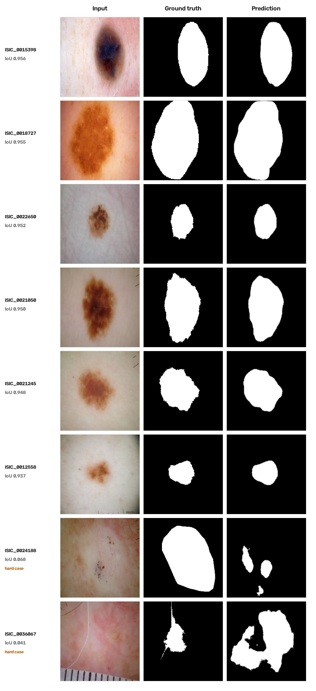

# Project Documentation

Complete technical reference for **Aggregation of U-Net-Based Pre-Trained Deep
Convolutional Models with Evolution Strategy** — skin lesion segmentation on ISIC 2018
using five U-Net variants combined by a genetic algorithm-optimised weighted ensemble.

MSc thesis, Cyprus International University, 2024.
Supervisor: Asst. Prof. Dr. Emre Özbilge.
Published as: Cheraghchian & Özbilge, *Ensembling U-Net-Based Models for Lesion
Segmentation Through Genetic Algorithm*, ICAFS 2025, Iași, Romania.

**Contents**

1. [Problem](#1-problem)
2. [Dataset](#2-dataset)
3. [Architectures](#3-architectures)
4. [Transfer learning](#4-transfer-learning)
5. [Training](#5-training)
6. [Ensembling](#6-ensembling)
7. [Evaluation metrics](#7-evaluation-metrics)
8. [Results](#8-results)
9. [Comparison with published work](#9-comparison-with-published-work)
10. [Limitations and future work](#10-limitations-and-future-work)
11. [Environment and reproduction](#11-environment-and-reproduction)
12. [Repository map](#12-repository-map)
13. [Reproducibility notes](#13-reproducibility-notes)

---

## 1. Problem

Melanoma has a roughly 99% five-year survival rate when caught early, dropping sharply
once it advances. Automated diagnosis begins with **segmentation**: drawing the lesion
boundary in a dermoscopic image. This is hard because lesions vary in size, shape,
texture and colour, and images carry artefacts — hair, shadows, specular reflections,
ruler marks and ink.

Classical thresholding and active-contour methods depend on hand-designed features that
generalise poorly across datasets. CNNs, and U-Net in particular, learn the boundary
directly from data and have become the standard approach.

This project asks a narrower question: **given several U-Net variants that each segment
reasonably well, can an evolutionary algorithm find a blend of them that beats all of
them — and beats a plain average — on limited hardware?**

---

## 2. Dataset

**ISIC 2018 Challenge, Task 1 (Lesion Boundary Segmentation).** Dermoscopic images with
expert-annotated binary ground truth masks.

| Split | Images | Masks |
|---|---|---|
| Training | 2,594 | 2,594 |
| Validation | 100 | 100 |
| Test | 1,000 | 1,000 |

These are the **official challenge splits**, not a random partition — the code globs the
`ISIC2018_Task1-2_*_Input` and `ISIC2018_Task1_*_GroundTruth` directories directly
(`src/common/data.py`).

### Preprocessing

| Step | Detail |
|---|---|
| Resize | All images and masks to 256 × 256 |
| Normalise | Pixel values divided by 255 → [0, 1] |
| Masks | Binarised: lesion = 1, background = 0 |
| Colour | Images read as 3-channel BGR via OpenCV; masks as single-channel grayscale |

No augmentation was applied. The pipeline is built with `tf.data`, mapped through
`tf.numpy_function`, batched, prefetched with `AUTOTUNE` and repeated.

---

## 3. Architectures

All five models share the U-Net encoder–decoder shape with skip connections. They differ
only in the encoder.

### 3.1 U-Net (baseline)

Built from scratch. Five levels, encoder filters 64 → 128 → 256 → 512, bridge at 1024,
mirrored decoder. Each `conv_block` is two 3×3 convolutions, each followed by batch
normalisation and ReLU. Downsampling by 2×2 max pooling; upsampling by
`Conv2DTranspose` with stride 2, concatenated with the matching encoder feature map.
Output is a 1×1 convolution with sigmoid activation → a single-channel probability map.

The skip connections are what make U-Net work for segmentation: they carry
high-resolution spatial detail from the encoder directly into the decoder, recovering
boundary precision that pooling destroys.

### 3.2 U-Net + MobileNetV3Large

Lightweight encoder designed for mobile and embedded inference. Uses depthwise separable
convolutions and inverted residual blocks, with Squeeze-and-Excitation modules that
reweight channels to emphasise informative features. Lowest computational cost of the
five.

### 3.3 U-Net + ConvNeXtBase

A modernised ConvNet that borrows design choices from vision transformers: large (7×7)
depthwise kernels, Layer Normalisation instead of Batch Normalisation, GELU activation,
and residual connections. The large receptive field helps on lesions with complex,
irregular boundaries.

### 3.4 U-Net + ResNet50V2

Residual network with pre-activation blocks — batch norm and ReLU are applied *before*
the convolutions, which improves gradient flow in deep stacks. Bottleneck blocks are
1×1 → 3×3 → 1×1. Stage depths 3, 4, 6, 3.

Encoder taps used for skip connections:

| Skip | Layer | Shape |
|---|---|---|
| s1 | `conv1_conv` | 128 × 128 × 64 |
| s2 | `conv2_block3_out` | 64 × 64 × 256 |
| s3 | `conv3_block4_out` | 32 × 32 × 512 |
| s4 | `conv4_block6_out` | 16 × 16 × 1024 |
| bridge | `conv5_block3_out` | 8 × 8 × 2048 |

**This was the strongest single model** (see §8).

### 3.5 U-Net + VGG19

The classic deep CNN: 16 convolutional layers in five blocks, all 3×3 with stride 1 and
padding, ReLU after each, 2×2 max pooling between blocks. Filter depths 64, 128, 256,
512, 512. Simple and dependable — no residual or attention machinery.

---

## 4. Transfer learning

The four non-baseline models initialise their encoder from **ImageNet-pretrained
weights** and set `trainable = False`. The decoder is always randomly initialised and
trained from scratch.

The reasoning: the early layers of any image CNN learn edges, textures and simple shapes
that transfer across domains, including from natural photographs to dermoscopy. With
only 2,594 training images, learning those from scratch wastes capacity and invites
overfitting. Freezing the encoder also cuts training time substantially, which mattered
given the hardware (§11).

The trade-off is that a frozen encoder cannot adapt its low-level filters to dermoscopic
colour statistics. Unfreezing and fine-tuning at a low learning rate is the obvious next
experiment.

---

## 5. Training

Identical hyperparameters across all five models:

| Setting | Value |
|---|---|
| Input | 256 × 256 × 3 |
| Batch size | 8 |
| Epochs | 50 maximum |
| Optimiser | Adam, learning rate 1e-5, `clipnorm=1.0` |
| Loss | Binary cross-entropy |
| Tracked metrics | Dice coefficient, IoU, Precision, Recall |
| LR schedule | `ReduceLROnPlateau` — monitor `val_loss`, factor 0.1, patience 5, min 1e-7 |
| Early stopping | monitor `val_loss`, patience 10, `restore_best_weights=True` |
| Checkpointing | `ModelCheckpoint`, `save_best_only=True` |
| Logging | `CSVLogger` + `TensorBoard` |
| Seeds | NumPy and TensorFlow both seeded to 42 |

Dice loss is implemented in `src/common/metrics.py` and was evaluated, but binary
cross-entropy was used for the reported runs.

### Observed training behaviour

- **U-Net** — stopped early at epoch 20. Training loss fell smoothly 0.45 → 0.07;
  validation loss bottomed near 0.22 around epoch 9 then oscillated, a mild overfitting
  signal. Validation Dice kept climbing regardless, ending near 0.79.
- **MobileNetV3Large** — steady training decline with a sharp validation improvement
  before epoch 40, consistent with escaping a local minimum or an LR reduction.
- **ConvNeXtBase** — the cleanest curves of the five. Validation loss plateaued after
  epoch 5; validation Dice briefly exceeded training Dice, indicating good
  generalisation.
- **ResNet50V2** — noisy early epochs, then a strong climb to a high plateau.
- **VGG19** — validation loss dropped at epoch 15 with a matching Dice jump, then
  stabilised near 0.80.

Curves: [`results/figures/`](../results/figures).

---

## 6. Ensembling

Both methods blend **soft predictions** — the per-pixel probability maps, not the
binarised masks. Discarding probabilities before combining throws away exactly the
confidence information that makes ensembling work.

### 6.1 Average ensembling

Unweighted mean of the five probability maps, then threshold at 0.5:

```
P_ensemble(x, y) = (1/N) · Σ P_i(x, y)        N = 5
```

Simple, and it beat four of the five individual models — but not ResNet50V2, because
weighting every model equally lets the three weaker models drag down the strongest.
That failure is the motivation for §6.2.

### 6.2 Genetic algorithm ensembling

Instead of equal weights, search for the weight vector **w** = (w₁ … w₅) that maximises
segmentation quality:

```
P_ensemble(x, y) = Σ wᵢ · Pᵢ(x, y)
```

**Fitness** is the mean Jaccard index of the thresholded blend against ground truth,
computed over the **validation** set. Jaccard rather than Dice because it penalises both
over- and under-segmentation more sharply, and because it is the ISIC challenge's own
primary metric.

Crucially, weights are fitted on validation and reported on test — the blend never sees
the test set.

| Component | Setting |
|---|---|
| Genome | Five real-valued weights |
| Population | Randomly initialised weight vectors |
| Selection | **Elitism**, top 5% carried to the next generation unchanged |
| Crossover | **Single-point**, rate 0.8 |
| Mutation | **Gaussian**, initial rate 0.05 |
| Mutation annealing | `rate = initial_rate × (1 − generation / num_generations)` |
| Normalisation | Weights scaled to sum to 1 |
| Generations | 100 maximum; early stopping after 20 generations without improvement |

**Why these choices.** Elitism guarantees the best solution is never lost to an unlucky
crossover, so fitness is monotonically non-decreasing. A 0.8 crossover rate keeps
exploration high while letting one in five parents pass through untouched. A 0.05
mutation rate is low enough to avoid degenerating into random search; annealing it
toward zero shifts the run from exploration early to refinement late. Normalising to 1
stops any single model from dominating by scale alone.

Two alternative selection strategies were implemented and compared: **tournament
selection** and a **microbial GA**. Neither beat elitism (§8.4).

### 6.3 Threshold sweep

The blended probability map is binarised at 0.4, 0.5 and 0.6. Lower thresholds favour
recall (catch every lesion pixel, accept false positives); higher thresholds favour
precision. 0.6 gave the best balance and is the headline configuration.

---

## 7. Evaluation metrics

Let *X* be the predicted pixel set and *Y* the ground truth pixel set.

| Metric | Definition | Reads as |
|---|---|---|
| Dice coefficient | 2·\|X ∩ Y\| / (\|X\| + \|Y\|) | Overlap, 0–1 |
| Jaccard / IoU | \|X ∩ Y\| / \|X ∪ Y\| | Stricter overlap, 0–1 |
| Precision | TP / (TP + FP) | How many predicted lesion pixels were right |
| Recall / Sensitivity | TP / (TP + FN) | How many true lesion pixels were found |
| F1-score | 2·(P·R) / (P + R) | Harmonic mean of the two |
| Accuracy | (TP + TN) / total | Weak here — background dominates |

**Thresholded Jaccard** is the ISIC 2018 challenge rule: a per-image Jaccard below 0.65
is recorded as 0 before averaging. It punishes catastrophic failures far harder than a
plain mean and is the metric the official leaderboard ranks on.

Accuracy is reported for comparability with published work, but on this task it is
misleading — most pixels are background, so a model predicting "no lesion everywhere"
would still score highly.

---

## 8. Results

All figures are on the **1,000-image ISIC 2018 test set**.

### 8.1 Individual models

| Model | Accuracy | Dice | Jaccard | Sensitivity | Precision | Thresh. Jaccard |
|---|---|---|---|---|---|---|
| U-Net (baseline) | 0.896 | 0.811 | 0.716 | 0.868 | 0.829 | 0.611 |
| U-Net + MobileNetV3Large | 0.905 | 0.825 | 0.739 | 0.837 | **0.884** | 0.654 |
| U-Net + ConvNeXtBase | 0.895 | 0.815 | 0.724 | 0.858 | 0.844 | 0.622 |
| U-Net + ResNet50V2 | **0.927** | **0.870** | **0.786** | **0.914** | 0.859 | **0.717** |
| U-Net + VGG19 | 0.906 | 0.824 | 0.730 | 0.860 | 0.856 | 0.630 |

ResNet50V2 leads on every metric except precision. MobileNetV3Large is the most
conservative predictor — highest precision, lowest sensitivity — which is the expected
signature of a lightweight model that under-segments. Every pretrained encoder beat the
from-scratch baseline, confirming the transfer learning premise.

### 8.2 Ensembles

| Method | Accuracy | Dice | Jaccard | Sensitivity | Precision | Thresh. Jaccard |
|---|---|---|---|---|---|---|
| Average ensemble | 0.918 | 0.852 | 0.770 | 0.879 | 0.880 | 0.697 |
| **GA-weighted ensemble** | **0.931** | **0.878** | **0.804** | 0.891 | **0.901** | **0.743** |

The GA ensemble beats the average ensemble on every single metric, and beats the best
individual model (ResNet50V2) by +0.008 Dice, +0.018 Jaccard and +0.026 thresholded
Jaccard. The precision gain (0.880 → 0.901) at essentially unchanged sensitivity says
the optimiser mainly learned to suppress false positives.

### 8.3 Threshold sweep (GA ensemble)

| Threshold | Accuracy | Dice | Jaccard | Sensitivity | Precision |
|---|---|---|---|---|---|
| 0.4 | 0.9280 | 0.871 | 0.789 | **0.919** | 0.858 |
| 0.5 | 0.9301 | 0.876 | 0.799 | 0.906 | 0.880 |
| **0.6** | **0.9306** | **0.878** | **0.804** | 0.891 | **0.901** |

A textbook precision/recall trade-off: raising the threshold costs 2.8 points of
sensitivity and buys 4.3 points of precision, netting a gain in both Dice and Jaccard.

### 8.4 GA selection strategies

Best validation Jaccard reached by each variant:

| Variant | Script | Best fitness |
|---|---|---|
| Single-point crossover + Gaussian mutation | `ga_ensemble_simple.py` | 0.8164 |
| Tournament selection | `ga_ensemble_tournament.py` | 0.8128 |
| Microbial GA | `ga_ensemble_microbial.py` | 0.8031 |

Elitism with single-point crossover converged fastest and highest. Best fitness rises
steeply for the first ~5 generations, then plateaus — the search space is only five
dimensional, so there is not much left to find once the dominant weight is located.
Average fitness converging toward best fitness shows the whole population, not just the
elite, moving to good solutions.

Per-generation fitness arrays and final weight vectors:
[`results/ga_artifacts/`](../results/ga_artifacts).

### 8.5 Qualitative results



Across all 1,000 test images the ensemble achieves a median IoU of 0.80, with 500 images
above 0.80 and 93 above 0.90. The failure mode is consistent: **low-contrast lesions on
pale skin**, where the boundary is ambiguous even to a human eye, produce fragmented
multi-component masks. The two hard cases above are examples.

---

## 9. Comparison with published work

| Model | Dataset | Accuracy | Dice | Jaccard | Reference |
|---|---|---|---|---|---|
| U-Net | ISIC 2018 | 0.930 | 0.828 | 0.734 | Behera et al., 2024 |
| ResUNet | ISIC 2018 | 0.910 | 0.777 | 0.678 | Behera et al., 2024 |
| F-SegNet | ISIC 2018 | 0.950 | 0.928 | 0.862 | Taghizadeh & Mohammadi, 2022 |
| InSiNet | ISIC 2018 | 0.945 | — | — | Reis et al., 2022 |
| MobileNetV2 + DeepLabV3+ | ISIC 2018 | 0.914 | — | 0.881 | Zafar et al., 2023 |
| DAGAN | ISIC 2018 | 0.929 | 0.885 | 0.824 | Lei et al., 2020 |
| Retina + MaskRCNN | ISIC 2018 | — | 0.907 | 0.914 | Ahmed et al., 2022 |
| U-Net (transfer + fine-tune) | ISIC 2018 | 0.968 | — | 0.807 | Araújo et al., 2021 |
| DeepLabV3+ | ISIC 2018 | 0.969 | 0.912 | 0.848 | Masood et al., 2024 |
| **This work (GA ensemble)** | **ISIC 2018** | **0.930** | **0.878** | **0.804** | — |

### ISIC 2018 live leaderboard

200 teams entered the lesion boundary segmentation task. Ranked on thresholded Jaccard:

| Rank | Team | Approach | External data | Thresh. Jaccard |
|---|---|---|---|---|
| 1 | NMN_team | Ensemble of deep transfer learning multi-scale networks | No | 0.836 |
| 2 | M Mostafa Kamal Sarker | Multi-scale EfficientNet with attention | No | 0.832 |
| 3 | NMN_team (Jahanifar-Zamani-Alemi) | AMSB_ensambled_Th80_Tl75_V3 | No | 0.825 |
| 4 | TheExplorers UCSP | bgtxyz1 | **Yes** | 0.809 |
| 5 | Joe Riemersma | Ensemble + CRF | No | 0.804 |
| — | **This work** | GA-based ensemble strategy | No | **0.743** |

Honest reading: this sits below the top five, and the gap is real. What it demonstrates
is that a straightforward weighted ensemble of off-the-shelf backbones, optimised by a
GA, gets within ~0.09 thresholded Jaccard of purpose-built multi-scale architectures —
with no external data, no custom layers, and a single 8 GB laptop GPU. Note that every
approach in the top five is itself an ensemble or a multi-scale model.

---

## 10. Limitations and future work

**Hardware.** A single RTX 2070 Max-Q (8 GB) capped batch size at 8 and made broad
hyperparameter search impractical. Encoders stayed frozen partly for this reason.

**Dataset size.** 2,594 training images, no augmentation. Rare lesion morphologies are
underrepresented, which is visible in the low-contrast failures (§8.5).

**Frozen encoders.** No fine-tuning was performed. Unfreezing the top encoder blocks at a
low learning rate is the cheapest likely improvement.

**No cross-validation.** Single train/validation/test run; no confidence intervals on the
reported figures.

**GA scope.** Only the five blend weights were optimised. The GA could also search the
binarisation threshold, or per-region rather than global weights.

Directions worth pursuing:

1. **Augmentation and synthesis** — geometric and colour augmentation; GAN-generated
   samples for rare morphologies.
2. **Fine-tuning** — unfreeze encoders progressively.
3. **Hybrid optimisation** — GA combined with particle swarm optimisation, or
   multi-objective selection (NSGA-II) trading precision against recall explicitly.
4. **Clinical packaging** — real-time inference wrapped in a simple tool for
   dermatologists.
5. **Post-processing** — conditional random fields or morphological cleanup, which would
   directly address the fragmented-mask failure mode.

---

## 11. Environment and reproduction

### Hardware used

| Component | Spec |
|---|---|
| CPU | Intel Core i7-9750H @ 2.60 GHz, 6 cores |
| RAM | 16 GB DDR4 |
| GPU | NVIDIA GeForce RTX 2070 with Max-Q Design (8 GB) |
| OS | Windows 10 |

### Software

Python 3.10, TensorFlow 2.10, Keras 2.10, CUDA 11.2, cuDNN 8.1.
NumPy, OpenCV, scikit-learn, Pandas, Matplotlib, tqdm.

TensorFlow 2.10 is the last release with native Windows GPU support; later versions
require WSL2.

### Configuration

Paths come from environment variables, with repo-relative defaults:

| Variable | Default | Used by |
|---|---|---|
| `ISIC_DATASET_PATH` | `data/ISIC_Challenge_Dataset` | training, evaluation, ensembling |
| `TRAINED_MODELS_DIR` | `trained_models` | ensemble scripts loading `.keras` checkpoints |
| `SOFT_PREDICTIONS_DIR` | `results/soft_predictions` | both ensembling methods |
| `GA_WEIGHTS_PATH` | `results/ga_artifacts/best_weights_…_100gen_simple.npy` | GA evaluation |

### Expected dataset layout

```
ISIC_Challenge_Dataset/
├── ISIC2018_Task1-2_Training_Input/      2594 .jpg
├── ISIC2018_Task1_Training_GroundTruth/  2594 .png
├── ISIC2018_Task1-2_Validation_Input/     100 .jpg
├── ISIC2018_Task1_Validation_GroundTruth/ 100 .png
├── ISIC2018_Task1-2_Test_Input/          1000 .jpg
└── ISIC2018_Task1_Test_GroundTruth/      1000 .png
```

### Order of operations

```bash
pip install -r requirements.txt
export ISIC_DATASET_PATH=/path/to/ISIC_Challenge_Dataset

# 1. train each model (repeat for all five)
cd src/models/resnet50v2 && python train.py && python eval.py

# 2. export soft predictions for validation and test

# 3. ensemble
cd src/ensembling/average && python average_ensemble.py
cd ../genetic && python ga_ensemble_simple.py
```

---

## 12. Repository map

```
├── README.md                    project front page
├── docs/DOCUMENTATION.md        this file
├── requirements.txt             pinned dependencies
├── src/
│   ├── common/                  shared code — single source of truth
│   │   ├── metrics.py           Dice, IoU, Dice loss
│   │   ├── data.py              ISIC loading + tf.data pipeline
│   │   ├── inference.py         evaluation-time image IO and result strips
│   │   └── soft_predictions.py  per-model probability map loading
│   ├── models/
│   │   ├── unet/                model.py, train.py, eval.py
│   │   ├── mobilenetv3large/
│   │   ├── convnextbase/
│   │   ├── resnet50v2/
│   │   └── vgg19/
│   └── ensembling/
│       ├── average/             unweighted mean baseline
│       └── genetic/             three GA variants
└── results/
    ├── figures/                 training curves, prediction samples, GA fitness
    ├── metrics/                 per-model test metrics
    └── ga_artifacts/            best weights + per-generation fitness (.npy)
```

Each script adds the repository's `src/` to `sys.path` at import, so they can be run
directly from their own directory while still importing from `common`.

---

## 13. Reproducibility notes

For anyone re-running this work, including future me:

- **Saved GA runs.** `results/ga_artifacts/` contains five runs. The fitness arrays hold
  100 generations (`…_100gen_simple`, `…_gaussian`, unsuffixed) or 50 generations
  (`…_tournament`, `…_microbial`). The thesis reports a run that early-stopped at
  generation 31; that specific array is not among the saved artifacts, so the published
  figures should be treated as coming from a run whose per-generation trace was not
  retained.
- **Weight normalisation.** The `best_weights_*.npy` files store the raw best genome from
  each run. `normalize_weights()` is applied inside `mutate()` but `crossover()` runs
  afterwards without re-normalising, so the persisted vectors do not all sum to 1 and
  some contain small negative components. Normalise before use, or re-normalise inside
  the evolution loop.
- **Trained weights.** The `.keras` checkpoints are not in the repository — they exceed
  what is reasonable for Git. The ensembling scripts expect them under
  `$TRAINED_MODELS_DIR/<ModelName>/files/`.
- **Soft predictions.** Likewise not committed. Regenerate them from the trained models
  before running either ensembling method.
